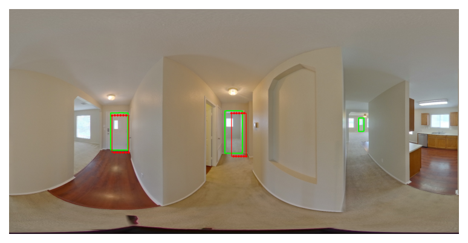
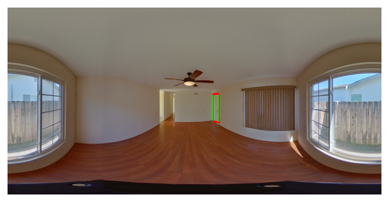
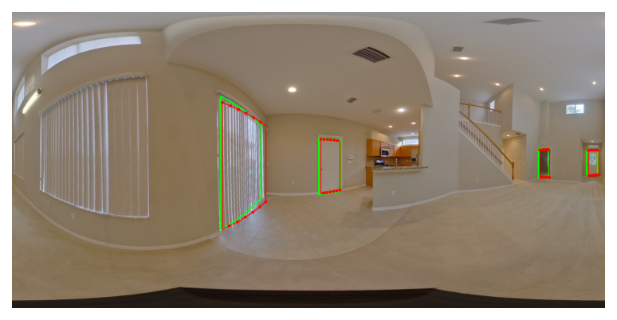
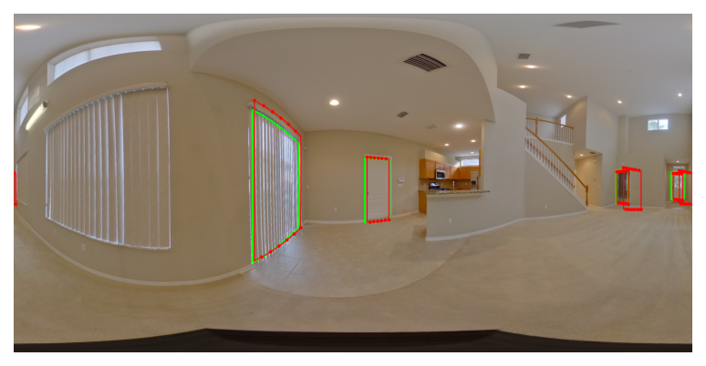
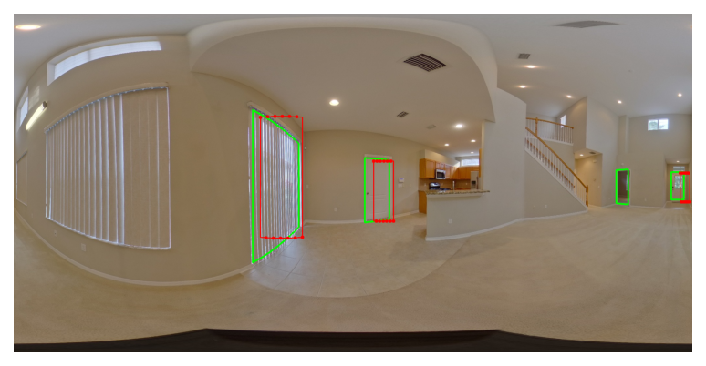
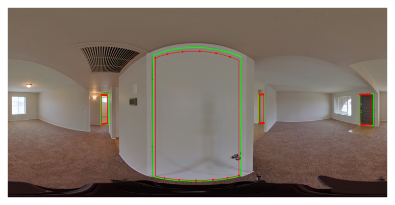
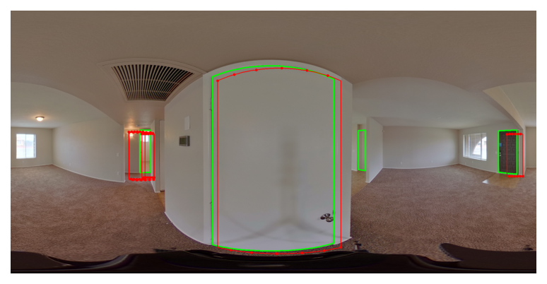

# DQ-HorizonNet

We introduces DQ-HorizonNet, a novel learning-based methodology that incorporates vertical features to enhance doors detection in indoor panoramic images. 

Building upon HorizonNet, which excels in estimating 3D indoor layouts from panoramic images using 1D vectors to identify boundaries, we identify a key limitation: HorizonNet's dense, column-wise prediction output is ill-suited for object detection tasks due to the need for complex post-processing to separate true positives from numerous false-positive predictions. 

DQ-HorizonNet innovatively addresses this issue through dynamic quantization, which clusters column-wise outputs and assigns learning targets dynamically, improving accuracy via a U-axis distance cost matrix that evaluates the discrepancy between predictions and actual data. 

Our model, tested on the extensive Zillow indoor dataset (ZInD), significantly outperforms existing methods, including the original HorizonNet and the transformer-based DETR network, showcasing its superior ability to accurately detect doors in panoramic indoor imagery.

| Ours  | HorizonNet  |  DETR |
|---|---|---|
|   |     |    |
|   |     |    |
|   |     |    |
|   |     |    |

### How to run
Please download the complete [ZInD dataset](https://github.com/zillow/zind), and set the path to variable `ZILLOW_DATASET_FOLDER` in the code.

To simply check the functionality, run this command:
`python DQHorizonNet.py --t`